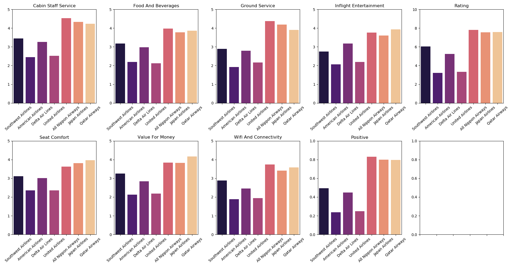
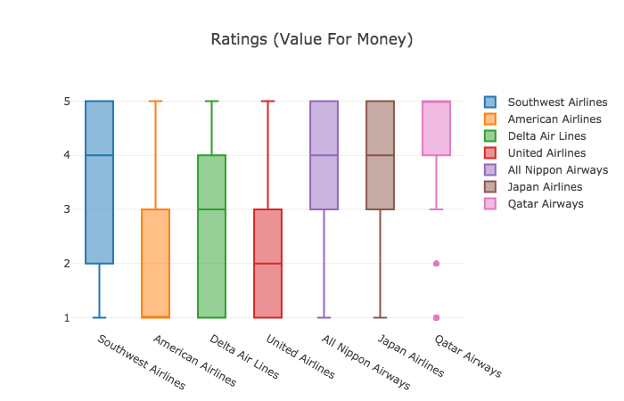
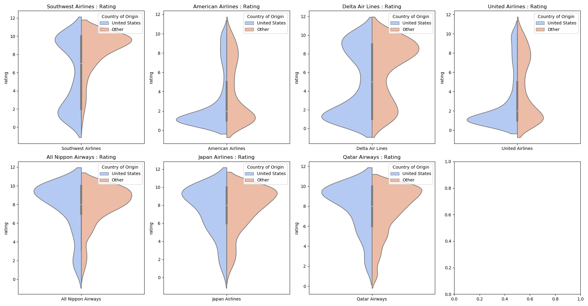
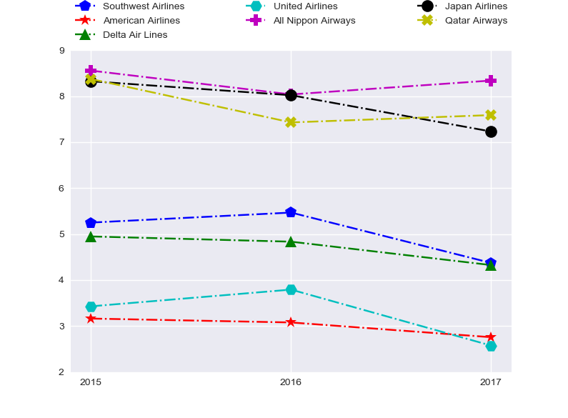
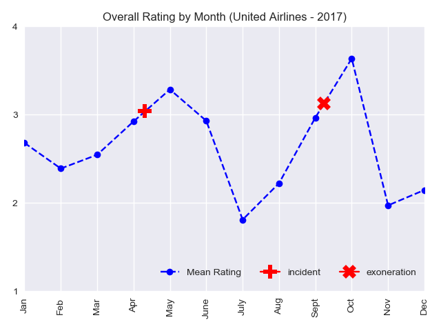
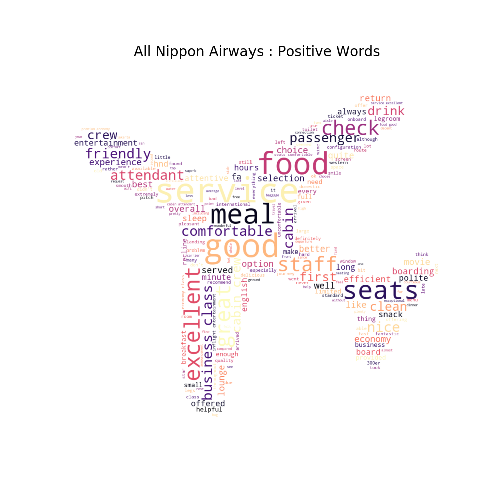
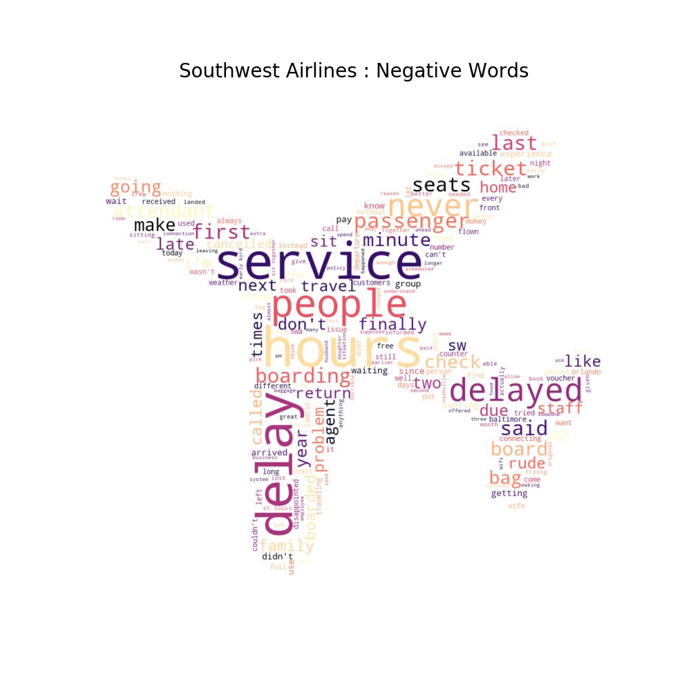
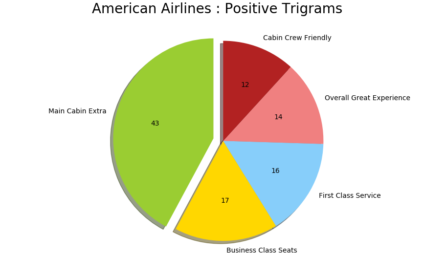
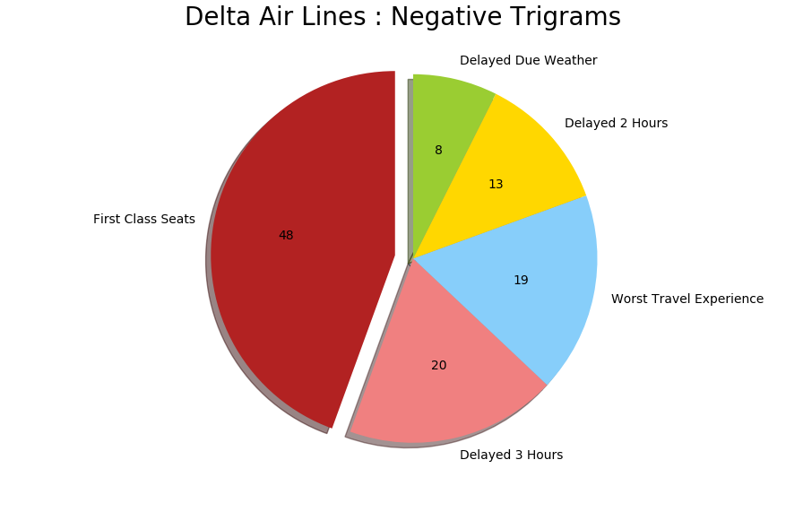

# Airline Capstone

This is a project that provides an in depth analysis of airline reviews.  The intent of this analysis is based on comparing and contrasting the effectiveness in different attributes of flights that led to positive sentiment from reviewers. 

The data was collected by webscraping reviews from the site AirlineQuality.com for the 4 biggest airlines in the United States, the 2 biggest airlines from Japan, and Qatar Airways which was considered Worlds best Airline by Skytrax in 2017 and was used as a benchmark.  The data was stored in PostgreSQL and the data was utilized for analysis from there.

# EDA

## Attribute Analysis

The above image shows the mean ratings by airline for different attributes of the flight.  As we can see, the Japanese Airlines tend to be better than all the larger American carriers, but specifically stand out in the service department.

Where Qatar seems to stand out, is the amenities it offers as part of their flight as well as the customer's perception of the value for money attribute.

## Cultural Analysis

Because there were so many reviews from Americans, I decided to see how Americans were rating their flight experience compared to those from other countries.

From the above graph, we can see that Americans tend to rate flight experience very similarly to others when it is a high quality airline.  For lower rated airlines, Americans are much more likely to give a very negative review compared to other cultures.  We can potentially theorize that Americans tend to speak their mind more readily if they are unsatisfied with a product.  More in depth analysis and larger data availability for other cultures may be needed in order to come to more concrete conclusions.

## Perception of Value Over Time

I was also curious about if certain airlines were improving or getting worse over time in terms of their average overall rating.

As one can see, most airlines tended to decrease in quality over time.  This is due to the small profit margins that the airline industry is subject to and their increasing costs for fuel, salaries, and government fees/taxes.  All Nippon Airways and Qatar Airways prove that they are committed to a quality flight experience as they actually improved their flight sentiment from 2016 to 2017.

## External Factors Effect on Perception of Quality

United had the largest drop (30%) in perception of quality from 2016 to 2017.  This is due to an event that unfolded on United Airlines that made it's way to the news.  On April 4th, 2017 a doctor was actually forced off an overbooked flight. From the below graph we can see that after people were notified of the event, the overall rating of flight satisfaction dropped drastically.  After July we notice some recovery and then in the beginning of September United is exonerated from the event, causing more news coverage and another sharp drop in flight satisfaction.

# NLP

## Common Words Positive/Negative Reviews

For Natural Language processing, words were taken from each review in order to analyze the context in which a customer decided their flight experience was negative or positive.  Below we can see some word clouds for positive and negative words that were commong for certain airlines.

## Trigrams

Here, we notice the phrases that are common in positive/negative reviews.  This gives us more of a context to see why a person may be satisfied/unsatisfied.

## Model

I utilized a Naive Bayes Classification model in order to classify reviews as positive and negative.  I achieved an average of 85% accuracy on all airlines.  Weights for positive and negative classification were optimized based on the availability of negative reviews.
Optimal alpha values for each model were determined by Grid Search.

# Conclusion

The information that was gained from analyzing these reviews was very insightful and can be utilized in real world scenarios in order to analyze the strengths and weaknesses of a company, utilize benchmarking on higher quality businesses to see how ones own company stacks up, and understand how external events and the human psychological reaction can have an effect on the perception of quality of a product.

