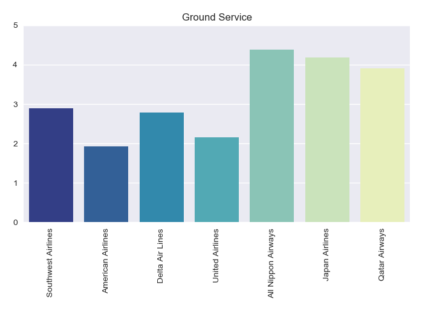

# Airline Capstone

This is a project that provides an in depth analysis of airline reviews.  The intent of this analysis is based on comparing and contrasting the effectiveness in different attributes of flights that led to positive sentiment from reviewers. 

The data was collected by webscraping reviews from the site AirlineQuality.com for the 4 of the biggest airlines in the United States, the 2 biggest airlines from Japan, and Qatar Airways which was considered Worlds best Airline by Skytrax in 2017 and was used as a benchmark.  The data was stored in PostgreSQL and the data was utilized for analysis from there.

# EDA

The above image shows the mean ratings by airline for different attributes of the flight.  As we can see, the Japanese Airlines tend to be better than all the larger American carriers, but specifically stand out in the service department.  Where Qatar seems to stand out, is the amenities it offers as part of their flight as well as the customer's perception of value for money paid.

The information that was gained from analyzing these reviews was very insightful and can be utilized in real world scenarios in order to analyze the strengths and weaknesses of a company, utilize benchmarking on higher quality businesses to see how ones own company stacks up, and understand how external events and the human psychological reaction can have an effect on the perception of quality of a product.

